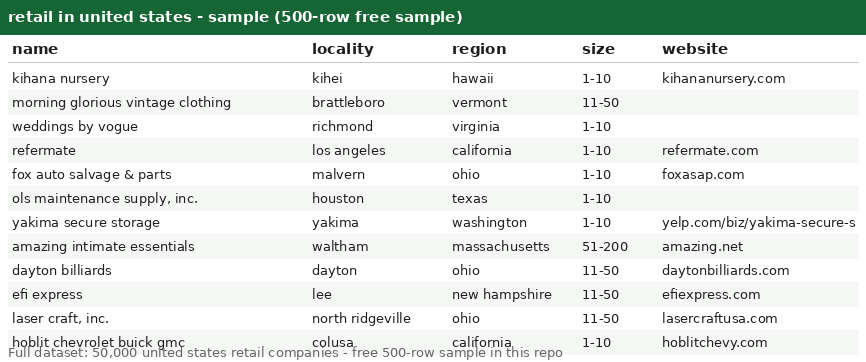

# Retail in United States -- United States Company Dataset with LinkedIn URLs (50,000 Records)

Welcome! This is a clean, ready-to-use list of **50,000 retail companies across united states** -- perfect for lead generation, market research, and data projects. Browse the free sample below to see the quality before you buy.

## Get the data

| File | Rows | Format | Link |
|---|---|---|---|
| **Free sample** | 500 rows | CSV | [companies_sample500.csv](companies_sample500.csv) |
| **Full dataset** | **50,000 rows** | CSV + JSON | Buy on Gumroad -- $2 per 10,000 records ($10 total) -> **[GUMROAD-PENDING-QUOTA]** |

> Start with the [free 500-row sample](companies_sample500.csv) -- same columns, same format as the full file. If it fits your workflow, grab the complete 50,000-row dataset on Gumroad.

---

## What's in this repo

This repo contains a **free 500-row sample** of retail united states companies. The sample lets you inspect the schema and data quality before buying the full file.

- **`companies_sample500.csv`** -- 500 real records, free ([download](companies_sample500.csv))
- **`preview.png`** -- screenshot of the sample opened in a spreadsheet (above)
- **Full dataset (`companies.csv` + `companies.json`, 50,000 rows)** -- available on Gumroad (link above), *not* included here to keep this repo light

## Fields

| Column | Description | Example |
|---|---|---|
| `country` | Country (all rows: `united states`) | `united states` |
| `founded` | Year founded (may be empty) | `1998` |
| `id` | Opaque source record ID | `ko2KSt76JQPYBCQLENsy9gnv7rdx` |
| `industry` | Industry (all rows: `retail`) | `retail` |
| `linkedin_url` | LinkedIn company page (domain + path) | `linkedin.com/company/kihana-nursery` |
| `locality` | City / town | `kihei` |
| `name` | Company name | `kihana nursery` |
| `region` | State / region (lowercase) | `hawaii` |
| `size` | Employee-count band | `1-10` |
| `website` | Company website domain (may be empty) | `kihananursery.com` |

**Notes:**
- `founded` and `website` are empty for some records.
- `size` values look like `1-10`, `11-50`, `51-200`, etc.
- CSV is UTF-8 with a header row; fields with commas are quoted.

## The full dataset (50,000 records -- on Gumroad)

- **50,000 united states retail companies**, same 10 columns as the sample
- Priced at **$2 per 10,000 records = $10 total**
- Delivered as `companies.csv` (+ JSON version) immediately after purchase
- Buy here -> **[GUMROAD-PENDING-QUOTA]**

## Use cases

Lead generation & prospecting | market sizing | competitive analysis | location analytics | data enrichment | ML training data | sales planning
